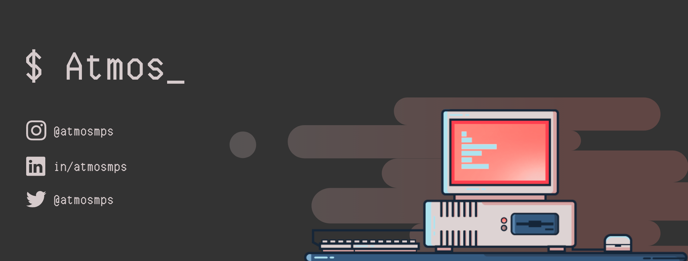

  <table>
    <tr>
        <td></td>
        <td></td>
    </tr>
  </table>

### Hi! Welcome 👨‍💻

💻 Software Engineer at [@luizalabs](https://github.com/luizalabs).

✍️ Sometimes i write on my [blog](http://atmosmps.me).
